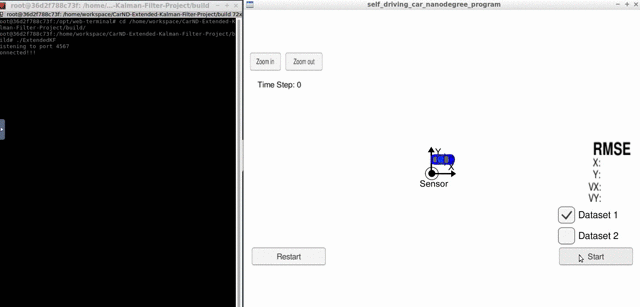
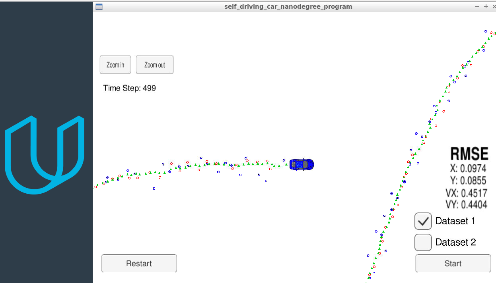

# Extended Kalman Filter Project

<!-- Self-Driving Car Engineer Nanodegree Program -->

[](http://www.udacity.com/drive)




# Overview

In this project I utilized a kalman filter to estimate the state of a moving object of interest with noisy lidar and radar measurements. The project obtained RMSE values that are lower than the tolerance outlined in the project rubric.

I used C++ to implement the [Extended Kalman Filter](https://en.wikipedia.org/wiki/Extended_Kalman_filter) (EKF). This project involves a Simulator which can be downloaded [here](https://github.com/udacity/self-driving-car-sim/releases), that provided by [Udacity](https://www.udacity.com/course/self-driving-car-engineer-nanodegree--nd013). The simulator providing simulated RADAR and LIDAR measurements and the EKF must fusion those measurements to predict the position of the object that travels around the vehicle. This project involve using an open source package called [uWebSocketIO](https://github.com/uNetworking/uWebSockets). This package facilitates the connection between the simulator and the code with C++. RADAR measurements are blue circles with an arrow pointing in the direction of the observed angle, LIDAR measurements are red circles, and estimation markers are green triangles.  The image below shows what the simulator looks like.




## Important Dependencies

The minimum project dependency versions are:

* cmake >= 3.5
  * All OSes: [click here for installation instructions](https://cmake.org/install/)
* make >= 4.1 (Linux, Mac), 3.81 (Windows)
  * Linux: make is installed by default on most Linux distros
  * Mac: [install Xcode command line tools to get make](https://developer.apple.com/xcode/features/)
  * Windows: [Click here for installation instructions](http://gnuwin32.sourceforge.net/packages/make.htm)
* gcc/g++ >= 5.4
  * Linux: gcc / g++ is installed by default on most Linux distros
  * Mac: same deal as make - [install Xcode command line tools](https://developer.apple.com/xcode/features/)
  * Windows: recommend using [MinGW](http://www.mingw.org/)
* Udacity's simulator


#### uWebSocketIO Starter Guide
The package does this by setting up a web socket server connection from the C++ program to the simulator, which acts as the host. In the project repository there are two scripts for installing uWebSocketIO - one for Linux and the other for macOS.

Note: Only uWebSocketIO branch e94b6e1, which the scripts reference, is compatible with the package installation.

This repository includes two files that can be used to set up and install [uWebSocketIO](https://github.com/uWebSockets/uWebSockets) for either Linux or Mac systems. For windows you can use either Docker, VMware, or even [Windows 10 Bash on Ubuntu](https://www.howtogeek.com/249966/how-to-install-and-use-the-linux-bash-shell-on-windows-10/) to install uWebSocketIO. Please see the uWebSocketIO Starter Guide page in the classroom within the EKF Project lesson for the required version and installation scripts.


The particular project implementation was done on **Linux OS** and the rest of this documentation will be focused on Linux OS. The project support both Mac and Windows operating system. In order to install the necessary libraries, from the project repository directory run the script [install-mac.sh](https://github.com/aliasaswad/CarND-Extended-Kalman-Filter-P5/blob/master/install-linux.sh).


## Basic Build Instructions
    
Once the install for uWebSocketIO is complete, clone [CarND-Extended-Kalman-Filter-Project](https://github.com/udacity/CarND-Extended-Kalman-Filter-Project) the project's repository and cd to it. The main program can be built and run by doing the following from the project top directory.

1. Create a build directory: `mkdir build && cd build`
3. Compile:`cmake ..`
4. `make`, this will create two executables
    -  `ExtendedKF`, which is EKF implementation
    - `Test`, a simple unit tests using [Catch](https://github.com/catchorg/Catch2/blob/master/docs/tutorial.md)    
5. Finally, run `./ExtendedKF`


Note that the programs that need to be written to accomplish the project are src/FusionEKF.cpp, src/FusionEKF.h, kalman_filter.cpp, kalman_filter.h, tools.cpp, and tools.h

The program main.cpp has already been filled out, but feel free to modify it.

Here is the main protocol that main.cpp uses for uWebSocketIO in communicating with the simulator.


**INPUT**: values provided by the simulator to the c++ program

["sensor_measurement"] => the measurement that the simulator observed (either lidar or radar)


**OUTPUT**: values provided by the c++ program to the simulator

["estimate_x"] <= kalman filter estimated position x

["estimate_y"] <= kalman filter estimated position y

["rmse_x"]

["rmse_y"]

["rmse_vx"]

["rmse_vy"]

---


## Editor Settings

We've purposefully kept editor configuration files out of this repo in order to
keep it as simple and environment agnostic as possible. However, we recommend
using the following settings:

* indent using spaces
* set tab width to 2 spaces (keeps the matrices in source code aligned)

## Code Style

Please (do your best to) stick to [Google's C++ style guide](https://google.github.io/styleguide/cppguide.html).

## Generating Additional Data

This is optional!

If you'd like to generate your own radar and lidar data, see the
[utilities repo](https://github.com/udacity/CarND-Mercedes-SF-Utilities) for
Matlab scripts that can generate additional data.

## Project Instructions and Rubric

Note: regardless of the changes you make, your project must be buildable using
cmake and make!

More information is only accessible by people who are already enrolled in Term 2 (three-term version) or Term 1 (two-term version)
of CarND. If you are enrolled, see the Project Resources page in the classroom
for instructions and the project rubric.

## Hints and Tips!

* You don't have to follow this directory structure, but if you do, your work
  will span all of the .cpp files here. Keep an eye out for TODOs.
* Students have reported rapid expansion of log files when using the term 2 simulator.  This appears to be associated with not being connected to uWebSockets.  If this does occur,  please make sure you are conneted to uWebSockets. The following workaround may also be effective at preventing large log files.

    + create an empty log file
    + remove write permissions so that the simulator can't write to log
 * Please note that the ```Eigen``` library does not initialize ```VectorXd``` or ```MatrixXd``` objects with zeros upon creation.

## Call for IDE Profiles Pull Requests

Help your fellow students!

We decided to create Makefiles with cmake to keep this project as platform
agnostic as possible. Similarly, we omitted IDE profiles in order to ensure
that students don't feel pressured to use one IDE or another.

However! We'd love to help people get up and running with their IDEs of choice.
If you've created a profile for an IDE that you think other students would
appreciate, we'd love to have you add the requisite profile files and
instructions to ide_profiles/. For example if you wanted to add a VS Code
profile, you'd add:

* /ide_profiles/vscode/.vscode
* /ide_profiles/vscode/README.md

The README should explain what the profile does, how to take advantage of it,
and how to install it.

Regardless of the IDE used, every submitted project must
still be compilable with cmake and make.

## How to write a README
A well written README file can enhance your project and portfolio.  Develop your abilities to create professional README files by completing [this free course](https://www.udacity.com/course/writing-readmes--ud777).

