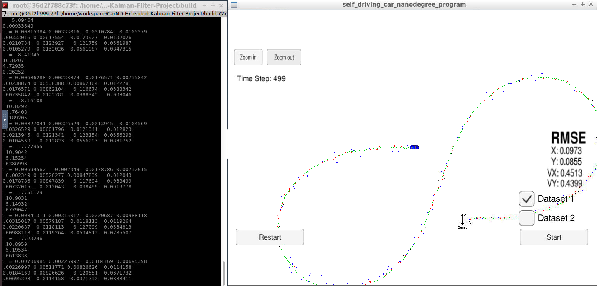
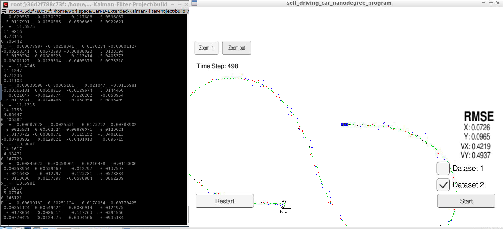

# Extended Kalman Filter Project

<!-- Self-Driving Car Engineer Nanodegree Program -->

# Overview

In this project I utilized a kalman filter to estimate the state of a moving object of interest with noisy lidar and radar measurements. The project obtained RMSE values that are lower than the tolerance outlined in the project rubric.

I used C++ to implement the [Extended Kalman Filter](https://en.wikipedia.org/wiki/Extended_Kalman_filter) (EKF). This project involves a Simulator which can be downloaded [here](https://github.com/udacity/self-driving-car-sim/releases), that provided by [Udacity](https://www.udacity.com/course/self-driving-car-engineer-nanodegree--nd013). The simulator providing simulated RADAR and LIDAR measurements and the EKF must fusion those measurements to predict the position of the object that travels around the vehicle. This project involve using an open source package called [uWebSocketIO](https://github.com/uNetworking/uWebSockets). This package facilitates the connection between the simulator and the code with C++. RADAR measurements are blue circles with an arrow pointing in the direction of the observed angle, LIDAR measurements are red circles, and estimation markers are green triangles.  The image below shows what the simulator looks like.

## Important Dependencies

The minimum project dependency versions are:

* cmake >= 3.5
  * All OSes: [click here for installation instructions](https://cmake.org/install/)
* make >= 4.1 (Linux, Mac), 3.81 (Windows)
  * Linux: make is installed by default on most Linux distros
  * Mac: [install Xcode command line tools to get make](https://developer.apple.com/xcode/features/)
  * Windows: [Click here for installation instructions](http://gnuwin32.sourceforge.net/packages/make.htm)
* gcc/g++ >= 5.4
  * Linux: gcc / g++ is installed by default on most Linux distros
  * Mac: same deal as make - [install Xcode command line tools](https://developer.apple.com/xcode/features/)
  * Windows: recommend using [MinGW](http://www.mingw.org/)
* Udacity's simulator

#### uWebSocketIO Starter Guide
The package does this by setting up a web socket server connection from the C++ program to the simulator, which acts as the host. In the project repository there are two scripts for installing uWebSocketIO - one for Linux and the other for macOS.

Note: Only uWebSocketIO branch e94b6e1, which the scripts reference, is compatible with the package installation.

This repository includes two files that can be used to set up and install [uWebSocketIO](https://github.com/uWebSockets/uWebSockets) for either Linux or Mac systems. For windows you can use either Docker, VMware, or even [Windows 10 Bash on Ubuntu](https://www.howtogeek.com/249966/how-to-install-and-use-the-linux-bash-shell-on-windows-10/) to install uWebSocketIO. Please see the uWebSocketIO Starter Guide page in the classroom within the EKF Project lesson for the required version and installation scripts.

The particular project implementation was done on **Linux OS** and the rest of this documentation will be focused on Linux OS. The project support both Mac and Windows operating system. In order to install the necessary libraries, from the project repository directory run the script [install-mac.sh](https://github.com/aliasaswad/CarND-Extended-Kalman-Filter-P5/blob/master/install-linux.sh).

# Basic Build Instructions
    
Once the install for uWebSocketIO is complete, clone [CarND-Extended-Kalman-Filter-Project](https://github.com/udacity/CarND-Extended-Kalman-Filter-Project) the project's repository and cd to it. The main program can be built and run by doing the following from the project top directory.

1. Create a build directory: `mkdir build && cd build`
3. Compile:`cmake ..`
4. `make`, this will create executable
    -  `ExtendedKF`, which is EKF implementation
<!--     - `Test`, a simple unit tests using [Catch](https://github.com/catchorg/Catch2/blob/master/docs/tutorial.md)     -->
5. Finally, run `./ExtendedKF`

<!-- 
# Running the tests

Inside the build directory, execute `./Tests` file . The output should be something similar to this:

`ERROR - CalculateRMSE () - The estimations vector is empty
ERROR - CalculateRMSE () - The ground-truth vector is empty
ERROR - CalculateRMSE () - The ground-truth and estimations vectors must have the same size.
ERROR - CalculateJacobian () - The state vector must have size 4.
ERROR - CalculateJacobian () - Division by Zero
===============================================================================
All tests passed (13 assertions in 2 test cases)`

These unit tests were an experiment with [Catch](). It looks like a good and simple unit testing framework for C++.
 -->

# Running the Filter

to run the EKF we need to run both `./ExtendedKF` From the build directory using the terminal and th simulator. The output for running `./ExtendedKF` file should be like:

`Listening to port 4567
Connected!!!`

Which means that the implemtation code now connected to the simulator right away as shown in the image below:

The simulator provides two datasets (1 and 2). The difference between them are:

* Direction: The car (the object) direction moving
* Order: The first measurement is sent to the EKF. On dataset 1, the LIDAR measurement is sent first and for the dataset 2, the RADAR measurement is sent first.

Here is the simulator final state after running the EKL with dataset 1:

Here is the simulator final state after running the EKL with dataset 2:

## EKF Data

The github repo contains one data file, `obj_pose-laser-radar-synthetic-input.txt` that provided by Udacity. The simulator will be using this data file, and feed [`main.cpp`](https://github.com/aliasaswad/CarND-Extended-Kalman-Filter-P5/blob/master/src/main.cpp) values from it, one line at a time. The `main.cpp` file creates instances of a **MeasurementPackage**. 
The measurement data for each line gets pushed onto a `measurement_pack_list`. The ground truth `[px, py, vx, vy]` for each line in the data file gets pushed ontoground_truthso RMSE can be calculated later from tools.cpp.

Here is a screenshot of the first data file:

|
|:--:| 
|*Screenshot of Data File*|

Each row represents a sensor measurement where the first column tells you if the measurement comes from radar (R) or lidar (L).

## Accuracy

**px, py, vx, vy** output coordinates must have an **RMSE** <= [0.11, 0.11, 0.52, 0.52] when using the file: [`obj_pose-laser-radar-synthetic-input.txt`](https://github.com/aliasaswad/CarND-Extended-Kalman-Filter-P5/tree/master/data) which is the same data file the simulator uses for Dataset 1".

The EKF **accuracy** is:

* Dataset 1: RMSE <= [0.0973, 0.0855, 0.4513, 0.4399]
* Dataset 2: RMSE <= [0.0726, 0.0965, 0.4216, 0.4932]

## Algorithm implementation

The Kalman filter implementation can be found under the [`src`](https://github.com/aliasaswad/CarND-Extended-Kalman-Filter-P5/tree/master/src) directory.  Kalmen filter file, named [`kalman_filter.cpp`](https://github.com/aliasaswad/CarND-Extended-Kalman-Filter-P5/blob/master/src/kalman_filter.cpp) is used to predict at [`FusionEKF.cpp`](https://github.com/aliasaswad/CarND-Extended-Kalman-Filter-P5/blob/master/src/FusionEKF.cpp) code_line [141](https://github.com/aliasaswad/CarND-Extended-Kalman-Filter-P5/blob/master/src/FusionEKF.cpp#L141) and to update code_line [152 to 164](https://github.com/aliasaswad/CarND-Extended-Kalman-Filter-P5/blob/master/src/FusionEKF.cpp#L152-#L164).

Here is the main protocol that main.cpp uses for uWebSocketIO in communicating with the simulator.

**INPUT**: values provided by the simulator to the c++ program

["sensor_measurement"] => the measurement that the simulator observed (either lidar or radar)

**OUTPUT**: values provided by the c++ program to the simulator

["estimate_x"] <= kalman filter estimated position x

["estimate_y"] <= kalman filter estimated position y

["rmse_x"]

["rmse_y"]

["rmse_vx"]

["rmse_vy"]

---

## Generating Additional Data

This is optional!

If you'd like to generate your own radar and lidar data, see the
[utilities repo](https://github.com/udacity/CarND-Mercedes-SF-Utilities) for
Matlab scripts that can generate additional data.

